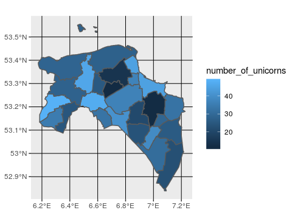

# README

In this small project I show how to work with shapefiles by plotting
features of the Netherlands with the simple features package.

This is an expansion of my original post in Januari 2017
http://rmhogervorst.nl/cleancode/blog/2017/01/06/plotting-a-map-with-ggplot2.html

Usually you want to combine shapefiles (that contain the boundaries of areas) with other information such as number of people. 

When you use the sf package, shape files are read as special dataframes, which is wonderful, because we already know how to work with dataframes!

In the script you can find how we filter out a certain area, and 
join other data to the tiles. 

